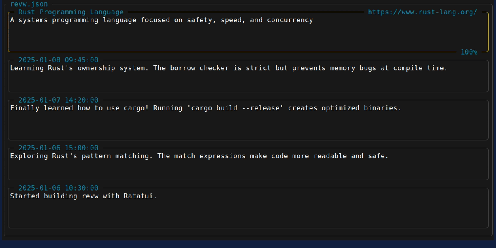

# Revw

[](https://opensource.org/licenses/MIT)
[](https://github.com/rlelf/revw)
[](https://ratatui.rs/)

A vim-like TUI for managing notes and resources.



## Relf Format

### Outside
External resources and references:
- **Name**: Title or identifier of the resource
- **Context**: Description or notes about the resource
- **URL**: Web address or link
- **Percentage**: Score or progress indicator, sortable for ordering

### Inside
Internal notes or thoughts with timestamps:
- **Date**: Timestamp of the entry, sortable for ordering
- **Context**: notes or thoughts

```json
{
  "outside": [
    {
      "name": "Rust Programming Language",
      "context": "A systems programming language focused on safety, speed, and concurrency.",
      "url": "https://www.rust-lang.org/",
      "percentage": 100
    }
  ],
  "inside": [
    {
      "date": "2025-01-01 00:00:00",
      "context": "Finally learned how to use cargo! Running 'cargo new my_project' creates such a clean project structure."
    }
  ]
}
```

This format is also available in [github.com/rlelf/relf](https://github.com/rlelf/relf)

## Install

```bash
cargo install --git https://github.com/rlelf/revw.git --locked
```

Or download from [Releases](https://github.com/rlelf/revw/releases)

## Usage

### Daily Usage with LLM
Revw is designed for LLM-assisted data management workflows:

#### Method 1: LLM → JSON → Revw
1. LLM generates a relf file
2. View the generated relf file in Revw
3. Edit the relf file in Revw

#### Method 2: Revw → JSON → LLM
1. Make a relf file in Revw
2. Edit the relf file in Revw
3. LLM assists with the relf file

### Command Line Options
```bash
# View help
revw --help

# Show version
revw --version

# Start without file
revw

# View mode
revw file.json

# Edit mode
revw --json file.json

# Output to stdout
revw --stdout file.json

# Output to file
revw --output output.txt file.json

# Output only INSIDE section
revw --stdout --inside file.json

# Output only OUTSIDE section
revw --stdout --outside file.json
```

## Controls

### View Mode
**Navigation:**
- `j/k` or `↑/↓` select card (or mouse wheel)
- `gg` select first card
- `G` select last card
- `:gi` jump to first INSIDE entry
- `:go` jump to first OUTSIDE entry
- `/` search forward
- `n/N` next/prev match (jumps to card)
- `:noh` clear search highlighting

**Editing:**
- `Enter` open edit overlay for selected card
- `:ai` add new INSIDE entry (jumps to it)
- `:ao` add new OUTSIDE entry (jumps to it)
- `:d` delete selected card
- `:o` order entries and auto-save

**Copy/Paste:**
- `c` copy all rendered content (with OUTSIDE/INSIDE headers)
- `:ci` copy INSIDE section only
- `:co` copy OUTSIDE section only
- `:cu` copy URL from selected card
- `v` paste file path or JSON content
- `:vi` paste INSIDE from clipboard (overwrite)
- `:vo` paste OUTSIDE from clipboard (overwrite)
- `:va` paste both INSIDE and OUTSIDE from clipboard (append)
- `:vai` paste INSIDE from clipboard (append)
- `:vao` paste OUTSIDE from clipboard (append)
- `:xi` clear INSIDE section
- `:xo` clear OUTSIDE section

**Other:**
- `r` toggle View/Edit mode
- `x` clear content
- `:h` help
- `q` quit

#### Edit Overlay
**Field Selection Mode (default):**
- `j/k` or `↑/↓` navigate between fields
- `Enter` enter field editing mode (shows cursor)
- `w` save changes
- `Esc` or `q` cancel

**Field Editing Mode:**
- `h/l` or `←/→` move cursor left/right
- `0` move to start of field
- `$` move to end of field
- `w` next word
- `b` previous word
- `e` end of word
- `g` or `gg` jump to start
- `G` jump to end
- `i` enter insert mode
- `Esc` or `Ctrl+[` exit to field selection mode

**Insert Mode:**
- Type to edit text
- `←/→` move cursor
- `Backspace` delete character
- `Esc` or `Ctrl+[` exit to field editing mode

### Edit Mode
**Navigation:**
- `h/j/k/l` or arrow keys - move cursor
- `e` next word end
- `b` previous word start
- `gg` jump to top
- `G` jump to bottom
- `:gi` jump to first INSIDE entry
- `:go` jump to first OUTSIDE entry
- Mouse wheel - scroll (drag disabled)

**Editing:**
- `i` enter insert mode
- `Esc` or `Ctrl+[` exit insert mode
- `:d` delete current entry
- `u` undo
- `Ctrl+r` redo
- `g-` undo
- `g+` redo

**Search:**
- `/` search forward
- `n/N` next/prev match
- `:noh` clear search highlighting

**Commands:**
- `:ai` add INSIDE entry
- `:ao` add OUTSIDE entry
- `:o` order entries
- `:ci` copy INSIDE section (JSON format)
- `:co` copy OUTSIDE section (JSON format)
- `:vi` paste INSIDE from clipboard (overwrite)
- `:vo` paste OUTSIDE from clipboard (overwrite)
- `:va` paste both INSIDE and OUTSIDE from clipboard (append)
- `:vai` paste INSIDE from clipboard (append)
- `:vao` paste OUTSIDE from clipboard (append)
- `:xi` clear INSIDE section
- `:xo` clear OUTSIDE section
- `:w` save
- `:wq` save and quit
- `:q` quit
- `:e` reload file
- `:ar` toggle auto-reload (default: on)
- `:h` help

## License

MIT
